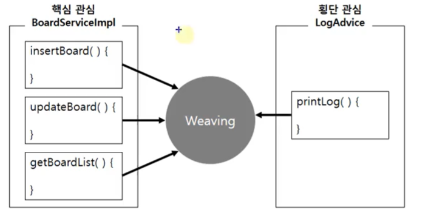
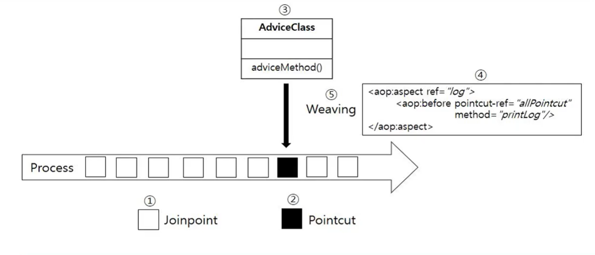

## 1. AOP(Aspect Oriented Programming)

낮은 결합도를 위해 IoC를 실현, 높은 응집도를 위해 AOP를 실현

**핵심기능과 부가기능 :**

- 업무로직을 포함하는 기능을 핵심기능(Core Concerns, Primary Concerns)
- 핵심기능을 도와주면서 공통적이고 반복적으로 처리하는 내용을 부가기능이라함(Cross-cutting Concerns, 횡단관심사)
- 프로그램 안에서 횡단 관심사에 해당하는 부분을 분리해서 한 곳으로 모으는 것을 횡단관심사의 분리라 하며, 이것을 실현하는 방법을 관점지향 프로그래밍(AOP)이라고함

<p align="center">
    
</p>

## 2. Spring AOP 임포트

```xml
<!-- AspectJ -->
<dependency>
    <groupId>org.aspectj</groupId>
    <artifactId>aspectjrt</artifactId>
    <version>${org.aspectj-version}</version>
</dependency>

<dependency>
    <groupId>org.aspectj</groupId>
    <artifactId>aspectjweaver</artifactId>
    <version>1.9.2</version>
</dependency>

```

## 3. xml 방식 적용

```java
@Service("boardService")
public class BoardServiceImpl implements BoardService{
    @Autowired
    private BoardDAO boardDAO;
}
```

xml 방식 aop 설정하기 위해서 xml파일에 aop 네임스페이스를 추가해야한다.

```xml
<context:component-scan base-package="com.springbook.biz"></context:component-scan>
<bean id ="Log" class="com.springbook.biz.common.LogAdvice"></bean>
<aop:config>
    <aop:pointcut id ="allPointcut" expression="excution(* com.springbook.biz..*Impl.*(..))"/>
    <aop:pointcut id ="getPointcut" expression="excution(* com.springbook.biz..*Impl.get*(..))"/>
    <aop:aspect ref="Log">
        <aop:before pointcut-ref="getPointcut" method="printLog"/>
    </aop:aspect>
</aop:config>
```

## 4. Aspect 또는 Advisor

- 부가기능을 정의한 코드인 어드바이스(Advice)와 어드바이스를 어디에 적용할지를 결정하는 포인트컷(PointCut)를 합친 개념이다.
- Advice + PointCut = Aspect
- 스프링 AOP에서는 클래스를 사용해서 구현한 뒤 스프링 xml 파일에 설정하거나, AspectJ 스타일의
  **@Aspect** 어노테이션을 적용한 클래스로 Aspect를 구현한다.
- 어떤 포인트 컷 메서드에 대해서 어떤 어드바이스 메소드를 실행할지 결정
- \<aop:aspect> 또는 \<aop:advisor>(트랜잭션 때 사용, 메서드의 이름을 모를 때)

## 5. Join Point

- 모든 비즈니스 로직 메서드이자 포인트컷의 후보
- 어드바이스(횡단관심사)가 실행될 지점이나 시점을 말한다.
- Spring AOP에서는 항상 메서드가 실행되는 시점을 가리킨다.
  - 왜냐하면 AOP를 적용할 수 있는 위치가 메소드로 한정되기 때문이다.

## 6. Pointcut

<p align="center">
    
</p>

- 수많은 조인 포인트 중에서 실제로 어드바이스(부가기능)를 적용할 곳을 선별하기 위한 표현식을 말한다.
- 스프링 AOP에서는 포인트 컷을 정의할 때 XML 기반 설정방식으로 빈 정의 파일(bean configuration file)을 만들거나, 어노테이션 기반 설정방식으로 소스코드에 주석 형태로 정의한다.
- 포인트컷 표현식은 execution으로 시작하고, 메서드의 Signature를 비교하는 방법을 주로 이용

## 7. Advice

트랜잭션 처리는 사후처리로 해야함

<p align="center">
    
</p>

- 특정 조인 포인트에서 실행되는 코드로 횡단 관심사를 실제로 구현해서 처리하는 부분이다.
- 어드바이스 동작 시점 5가지가 존재함
  - before
  - after
  - after-returning
  - after-throwing
  - around

## 8. 위빙(Weaving)

<p align="center">
    
</p>

- 스프링 AOP는 기본적으로 실행 시점에 위빙한다.
- 위빙은 포인트컷에 의해서 결정된 조인 포인트에 부가기능(어드바이스)을 삽입하는 과정이다.

## 9. Target

핵심 기능을 담고 있는 모듈로, 타겟은 부가기능을 부여할 대상이 된다.

## 10. AOP 동작 순서

<p align="center">
    
</p>

- 1. 사용자가 비즈니스 컴포넌트의 여러 조인포인트 호출
- 2. 이때 특정 포인트컷으로 지정한 메소드가 호출되는 순간,
- 3. 어드바이스 객체의 어드바이스 메소드가 실행되는데
- 4. 위 3번의 실행을 위한 설정, 애스팩트에 의해서 실행 된다.
- 5. 위 3번 4번 실행과정을 위빙이라고 한다.
