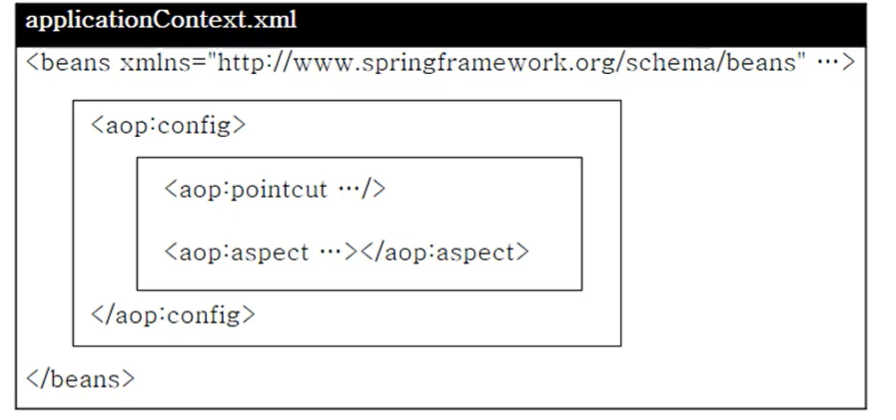

## 1. AOP와 관련된 다양한 설정 : XML 방식과 어노테이션 방식

**xml 기반의 POJO 클래스를 이용한 AOP 구현 :**

- 부가기능을 제공하는 Advice 클래스를 작성한다.
- xml 설정 파일에 \<aop:config>를 이용해서 애스펙트를 설정한다. (즉, 어드바이스와 포인트컷을 설정)

**@Aspect 어노테이션을 이용한 AOP 구현 :**

- @Aspect 어노테이션을 이용해서 부가기능을 제공하는 Aspect 클래스를 작성한다. 이때 Aspect 클래스는 어드바이스를 구현하는 메서드와 포인트컷을 포함한다.
- xml 설정 파일에 \<aop:aspectj-autoproxy/> 를 설정

## 2. xml 방식 설정

<p align="center">
    
</p>

**\<aop:config> 엘리먼트** :

- AOP 설정에서의 루트 엘리먼트(여러 번 사용가능)
- 하위 엘리먼트로 \<aop:pointcut>, \<aop:aspect>

**\<aop:pointcut> 엘리먼트** :

- 포인트컷 지정
- \<aop:config> 혹은 \<aop:aspect> 의 자식 엘리먼트 사용가능
- (단, \<aop:aspect>의 자식으로 설정된 포인트컷은 해당 \<aop:aspect>에서만 사용 가능하다.)

**\<aop:aspect> 엘리먼트** :

- 핵심 관심에 해당하는 포인트컷 메소드와 횡단관심에 해당하는 어드바이스 메소드를 결합하기 위해 사용
- 애스팩트를 어떻게 설정하느냐에 다라 위빙 결과가 달라짐
- 어드바이스 객체의 아이디나 메소드 이름을 모르면 사용 불가능

**\<aop:advisor> 엘리먼트** :

- \<aop:aspect> 엘리먼트와 같은 기능을 함
- 메소드의 이름을 모를 때 사용
- 트랜잭션 설정같은 몇몇 특수한 경우 \<aop:aspect> 엘리먼트 대신 사용

```java
public class LogAdvice {
    public void printLog() {
        System.out.println("logging!");
    }
}
```

```xml
<bean id="log" class="com.springbook.biz.common.LogAdvice"></bean>
<aop:config>
    <aop:pointcut id ="allPointcut" expression="execution(* com.springbook.biz..*Impl.*(..))">
    <aop:pointcut id ="getPointcut" expression="execution(* com.springbook.biz..*Impl.get*(..))">
    <aop:aspect ref="log">
        <aop:before pointcut-ref="getPointcut" method="printLog"/>
    </aop:aspect>

</aop:config>
```
