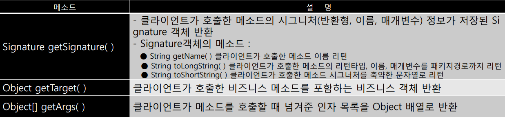

## 1. JoinPoint 인터페이스

JoinPoint 인터페이스 : 횡단 관심에 해당하는 어드바이스 메소드를 의미있게 구현하기 위해 클라이언트가 호출한 비즈니스 메소드의 다양한 정보가 포함되어 있는 인터페이스

```
Before / After Returning / After Throwing / After 어드바이스에서 사용!
```

<p align="center">
    
</p>

```java
public class BeforeAdvice {
    public void beforeLog(JoinPoint jp) {
        String method = jp.getSignature().getName();
        Object[] args = jp.getArgs();
        System.out.println("[사전 처리]" + method + "() 메소드 ARGS 정보 :" + args[0].toString());
    }
}
```

ProceedingJoinPoint 인터페이스 : JoinPoint를 상속받은 인터페이스이며, JoinPoint 메소드 +
proceed()메소드 추가

```
Around 어드바이스에서 사용!
```

```java
package com.springbook.biz.common;

import org.aspectj.lang.ProceedingJoinPoint;

public class AroundAdvice {
	public Object aroundLog(ProceedingJoinPoint pjp) throws Throwable {
		System.out.println("[BEFORE]: 비즈니스 메소드 수행 전에 처리할 내용...");
		Object returnObj = pjp.proceed();
		System.out.println("[AFTER]: 비즈니스 메소드 수행 후에 처리할 내용...");
		return returnObj;
	}
}
```

## 2. 바인드 변수

조인포인트에서 리턴된 값을 returnObj로 바인드 되어 전달 -> applicationContext.xml 확인

```java
package com.springbook.biz.common;

import org.aspectj.lang.JoinPoint;

import com.springbook.biz.user.UserVO;

public class AfterReturningAdvice {
	public void afterLog(JoinPoint jp, Object returnObj) {
		String method = jp.getSignature().getName();
		if (returnObj instanceof UserVO) {
			UserVO user = (UserVO) returnObj;
			if (user.getRole().equals("Admin")) {
				System.out.println(user.getName() + " 로그인(Admin)");
			}
		}
		System.out.println("[사후 처리] " + method + "() 메소드 리턴값 : " + returnObj.toString());
	}
}
```
