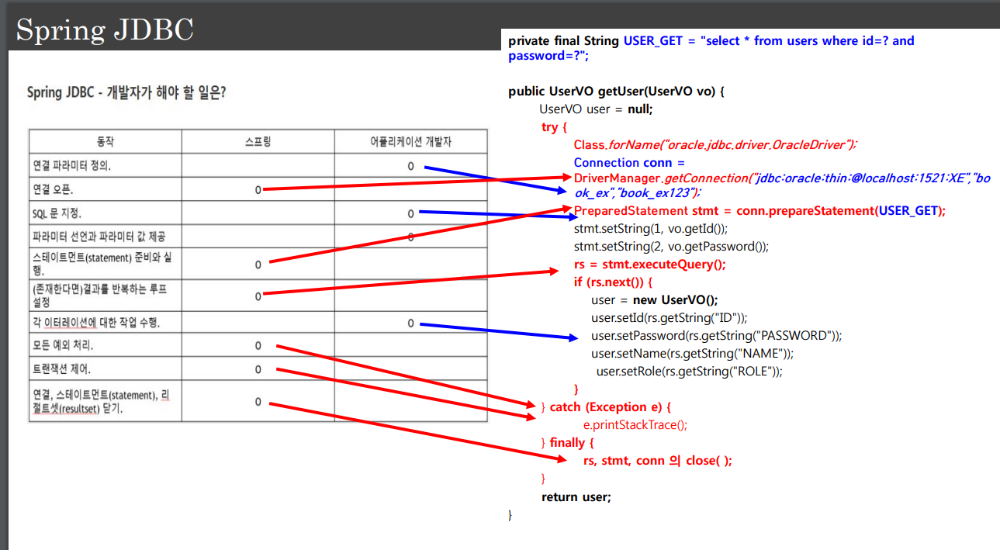
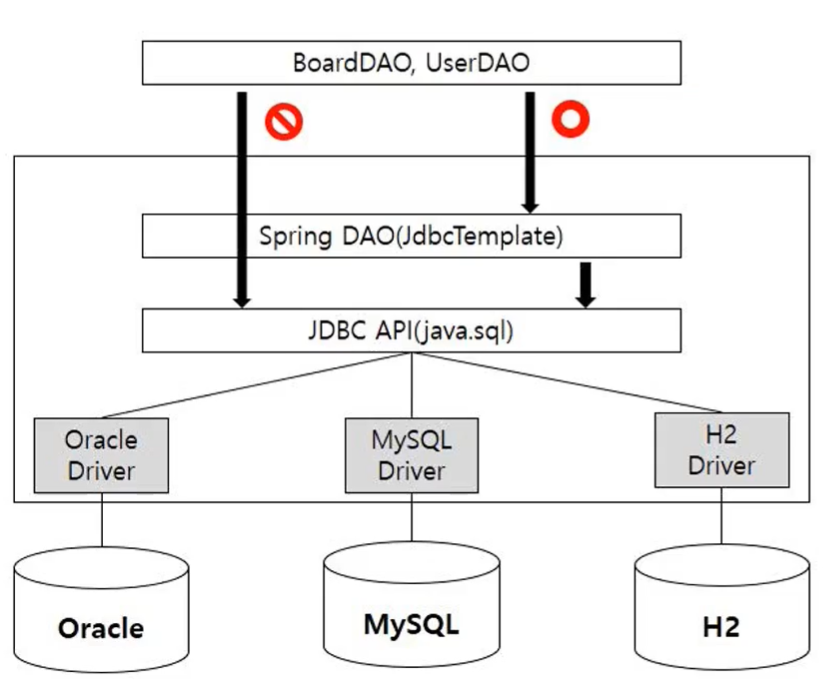
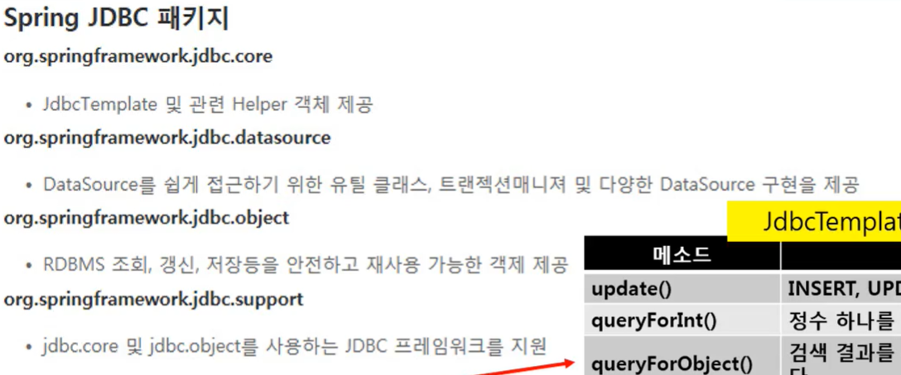
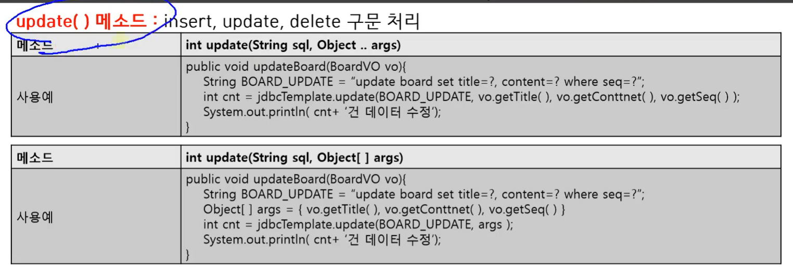
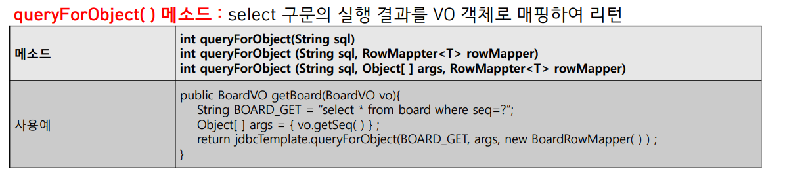
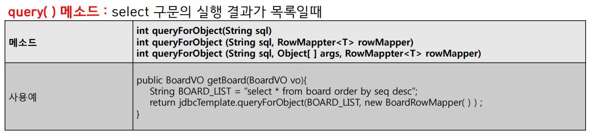

## 1. JDBC 프로그램의 문제

- 1. 정해진 순서대로 프로그램 구현
- 2. 모든 DB 연동 메소드에서 동일한 로직이 반복적으로 등장
- 3. 많은 코드로 인해 실수할 가능성이 높음
- 4. 결과적으로 유지보수가 어려움

## 2. JDBC 단계

- 1. driver 로딩
- 2. 유저 계정과 패스워드를 통해서 커넥션
- 3. 커넥션 객체를 얻어서 쿼리 생성
- 4. 쿼리 실행
- 5. 리턴받은 작업에 대한 추가적인 코드 필요
- 6. 예외 처리
- 7. 사후 처리
- 8. connection close

## 3. 스프링 JDBC

이러한 번거로운 작업들을 모아서 프레임워크나 모듈이 대신 해줌, 개발자는 로직에 신경쓸 수 있도록!

스프링 JDBC를 사용하면 파란색만 하면됌!

<p align="center">
    
</p>

## 4. 스프링 JDBC 구조

- jdbcTemplate를 통해서 위임받은 일들을 대신 실행
- 개발자는 jdbcAPi 직접 쓰는게 아니라 jdbcTemplate를 통해 api를 이용

<p align="center">
    
</p>

Spring JDBC 사용하려면 pom.xml 추가

```xml
<!--DBCP -->
<dependency>
    <groupId>commons-dbcp</groupId>
    <artifactId>commons-dbcp</artifactId>
    <version>1.4</version>
</dependency>
```

## 5. 스프링 JDBC package

<p align="center">
    
</p>

## 6. JDBC Template

- org.springframework.jdbc.core 에서 가장 중요한 클래스
- 리소스 생성, 해지를 처리해서 연결을 닫는 것을 잊어 발생하는 문제 등을 피할 수 있도록 한다
- 스테이트먼트의 생성과 실행을 처리
- sql조회, 업데이트, 저장 프로시저 호출, ResultSet 반복호출 등을 실행
- JDBC 예외가 발생할 경우 org.springframework.dao 패키지에 정의되어 있는 일반적인 예외로 변환

**JdbcTemplate 메소드** :

- update() : INSERT, UPDATE, DELETE 명령어를 처리
- queryForInt() : select 구문으로 검색된 정수값 리턴
- queryForObject() : 검색 결과를 객체(Value Object) 하나에 매핑하여 리턴
- query() : 검색 결과 여러 개를 java.util.List에 저장하여 리턴

## 7. Update 메서드

<p align="center">
    
</p>

## 8. queryForInt 메서드

<p align="center">
    
</p>

## 9. queryForObject 메서드

Mapper 객체가 VO에다가 검색된 결과를 넣는다.

<p align="center">
    
</p>

## 10. query 메서드

<p align="center">
    
</p>

```
예시가 잘못됌! List<BoardVO> 타입이 반환 타입이어야함
```
