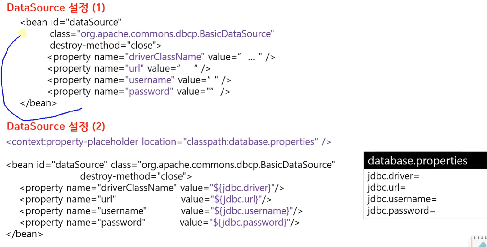
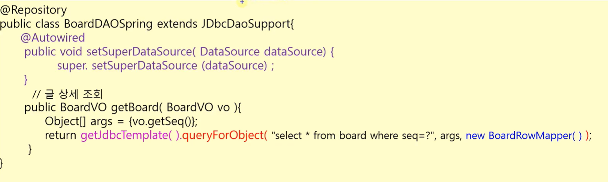
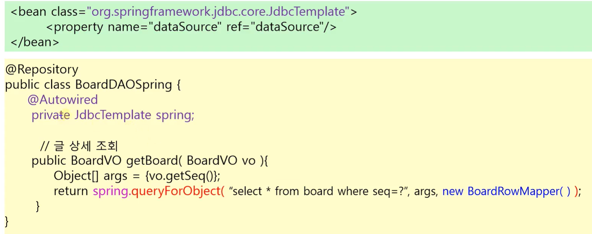

## 1. DataSource 설정

직접 DI할수도 있고 외부 파일로 분리해서 사용가능
bean 태그 id는 dataSource로 해야함 사용자는 value만 수정가능

<p align="center">
    
</p>

## 2. DAO 클래스에서 JdbcTemplate 객체 얻는 방법

두가지 방법이 있다.

**첫번째 방법 :**
JdbcDaoSupport 클래스를 상속해서 슈퍼클래스에 dataSource 객체를 setting 한 후,
getJdbcTemplate()메소드를 통해 JdbcTemplate 객체를 리턴 받음

<p align="center">
    
</p>

**두번째 방법 :**
JdbcTemplate 클래스를 \<bean>에 등록해서 의존성 주입

<p align="center">
    
</p>

## 3. RowMapper 구현

행마다 적용!

```java
class BoardRowMapper implements RowMapper<BoardVO> {
    public BoardVo mapRow(ResultSet rs, int rowNum) throws SQLException {
        BoardVO board = new BoardVO();
        board.setSeq(rs.getInt("SEQ"));
        board.setTitle(rs.getString("TITLE"));
        board.setWriter(rs.getString("WRITER"));
        board.setContent(rs.getString("CONTENT"));
        board.setRegDate(rs.getDate("REGDATE"));
        board.setCnt(rs.getInt("CNT"));
        return board;
    }
}
```
