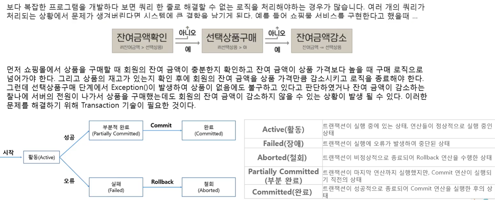
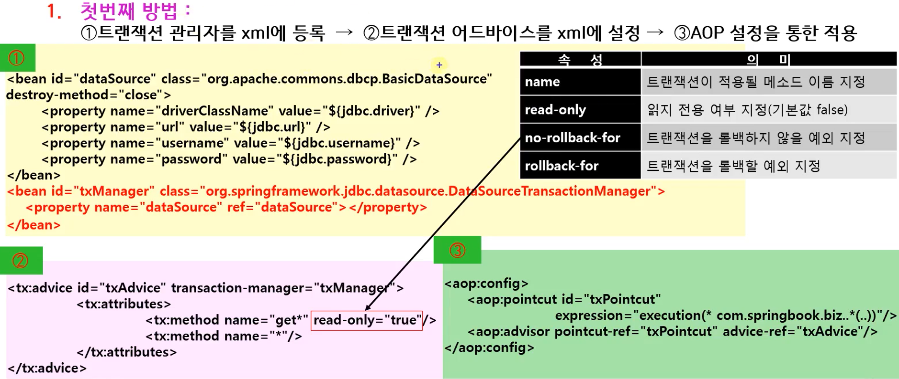
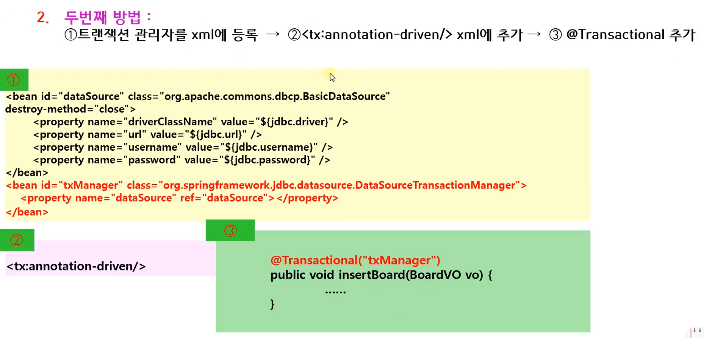
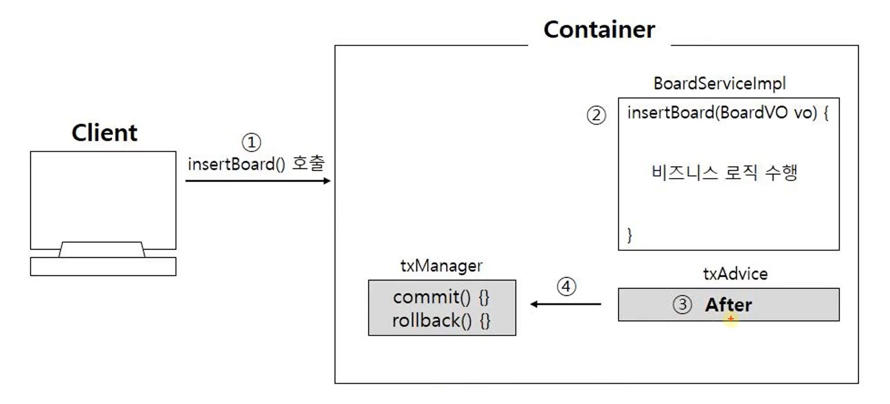

## 1. Transaction 이란?

데이터베이스의 상태를 변환시키는 하나의 논리적 기능을 수행하기 위한 작업의 단위
또는 한꺼번에 모두 수행되어야 할 일련의 연산들을 의미한다.

    

## 2. 트랜잭션 설정하는 법

    

    

## 3. Spring JDBC 트랜잭션 동작

트랜잭션은 무조건 after 시점에 실행되어야함

    

