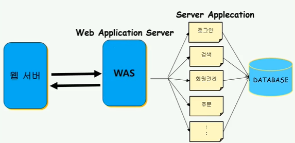
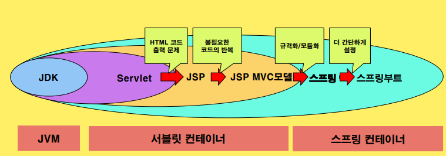
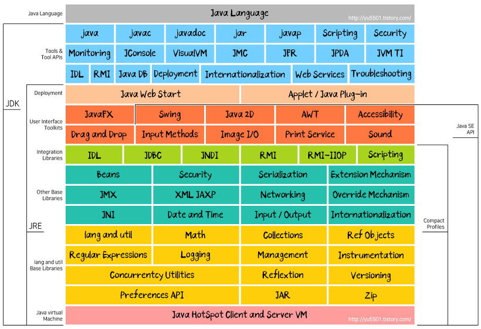

## 1. 전통적인 3 Tier Architecture(3계층 구조)인 JAVA WEB APP

<p align="center">
    
</p>

전통적인 3 Tier Architecture(3계층 구조)는
어떤 플랫폼을 3계층으로 나누어 별도의 논리적/물리적인 장치에 구축 및 운영하는 형태를 말한다.

JAVA 웹 애플리케이션(플랫폼)에서는 웹서버와 WAS라는 단어를 사용한다.

- 서버 애플리케이션: 클라이언트의 요청을 서버 애플리케이션(비즈니스로직 코드)이 실행

- WAS(Web Application Server): 서버내에서 해당 코드 블록을 관리 실행을 한다. (엔진이나 컨테이너라고도 함)

- 웹 서버: Http 요청에 대한 응답을 해주는 역할

- 자바진영에서는 주로 Tomcat이 WAS로 사용되며, 웹 서버의 기능도 한다.

```
노드 진영에 대입해서 생각하면 nginx(웹서버), nodejs(컨테이너, 엔진, 런타임, WAS)
```

## 2. 스프링 맥락 이해하기

<p align="center">
    
</p>

1. 처음에는 JDK로 내부에 있는 인터페이스를 이용해서 네트워크 통신 개발을 했음! 기본적으로 SRE 내부에 있는 Netwroking API를 이용해서 소켓 통신이 가능함

<p align="center">
    
</p>

2. Servlet이 나오고 이것을 이용해 웹 프로그래밍을 편하게 하기 시작! => 서블릿 컨테이너 등장

```
 Servlet:

 1. 클라이언트의 요청을 처리하고, 그 결과를 반환하는 Servlet 클래스의 구현 규칙을 지킨 자바 웹 프로그래밍 기술

 2. 자바를 사용하여 웹을 만들기 위해 필요한 기술

 3. 클라이언트가 어떠한 요청을 하면 그에 대한 결과를 다시 전송하는 역할을 함


 예를 들어, 어떠한 사용자가 로그인을 하려고 할 때. 사용자는 아이디와 비밀번호를 입력하고, 로그인 버튼을 누른다. 그때 서버는 클라이언트의 아이디와 비밀번호를 확인하고, 다음 페이지를 띄워주어야 하는데, 이러한 역할을 수행하는 것이 바로 서블릿(Servlet)라고 함
```

3. 아 근데 뭔가 아쉬움 왜냐하면 HTML 파일을 자바 내부에 쓰려고하니깐 힘들었음 => JSP(Java Server Pages) 등장 : Java 코드가 들어가 있는 HTML 코드

4. 불필요한 코드의 반복으로 디자인패턴의 필요성을 느낌 => JSP MVC 모델 등장

5. 점점 규격화, 모듈화를 하다보니 스프링이라는 프레임워크가 등장할 수 있었음 => 스프링 컨테이너 등장. 개발자는 비즈니스 로직에 신경쓸 수 있게 됨

6. 이것도 불편해! 설정해야할 게 너무 많아서 스프링 부트가 등장했음

## 3. Tomcat 폴더 구조

```
Tomcat 9.0
    - bin : 컨테이너인 톰캣의 배치파일(명령)

    - conf : 설정 파일들 모임
        - server.xml : 아파치 톰캣 서버 설정
            - <Host> 태그 내부에 Context 설정 가능
        - web.xml : 프로젝트 환경 설정

    - lib : 기본 라이브러리
        - jasper : jsp 변환 모듈
        - servlet-api : 서블릿 모듈

    - webapps : 애플리케이션 폴더
        - ROOT(기본) :
            - WEB-INF : 클라이언트가 액세스 불가능함
                - classes : 컴파일된 .class 파일 넣음
                - web.xml : 서블릿 매핑도 여기서 함!
            - index.jsp
    - temp
    - logs
    - work
```

web.xml 의 형식은 두가지 모두 같다. 차이점은 conf는 Tomcat 전체에 영향을 미치는 것이고, WEB-INF아래의 web.xml 파일은 해당 웹 어플리케이션에만 영향을 미친다.
