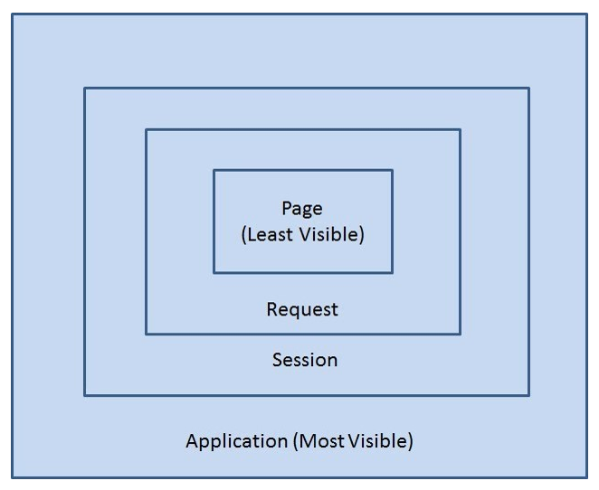
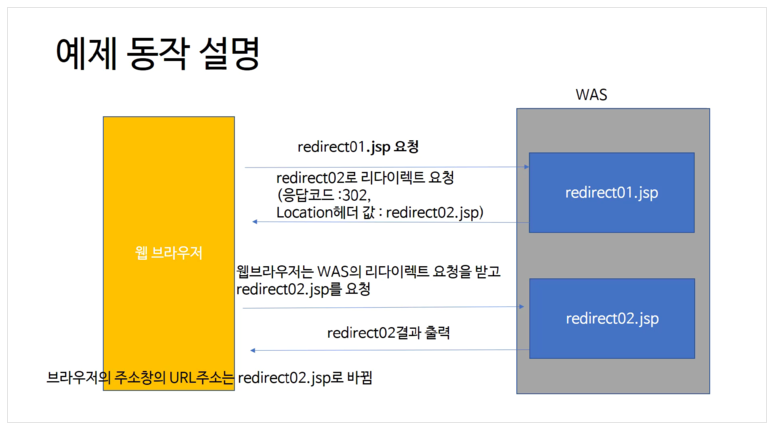
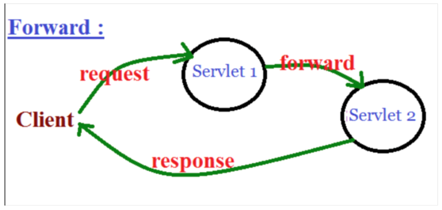

# 계산기 만들면서 MVC와 Servlet 이해하기

## 1. 두개의 숫자 입력과 연산자 버튼을 클릭해서 결과값을 구하는 서블릿

**request.getParameter**를 통해서 폼의 파라미터 값을 받아올 수 있다.

WebContent/Calc01.html

```html
<!DOCTYPE html>
<html lang="en">
  <head>
    <meta charset="UTF-8" />
  </head>
  <body>
    <form action="calcStep1" method="post">
      <div>
        <input type="text" name="x" />
        <input type="text" name="y" />
      </div>
      <div>
        <input type="submit" name="operator" value="덧셈" />
        <input type="submit" name="operator" value="뺄셈" />
      </div>
      <div>결과는 0</div>
    </form>
  </body>
</html>
```

src/package/CalculatorStep1.java

```java

import java.io.IOException;
import java.io.PrintWriter;
import javax.servlet.annotation.WebServlet; //!
import javax.servlet.http.HttpServlet;
import javax.servlet.http.HttpServletRequest;
import javax.servlet.http.HttpServletResponse;

@WebServlet("/calcStep1")
public class CalculatorStep1 extends HttpServlet {
    @Override
    public void service(HttpServletRequest req, HttpServletResponse res) throws ServletException, IOException {
        res.setCharacterEncoding("utf-8");
        res.setContentType("text/html; charset=utf-8");
        req.setCharacterEncoding("utf-8");

        String x_ = req.getParameter("x");
        String y_ = req.getParameter("y");
        String op_ = req.getParameter("operator");

        int x = 0;
        int y = 0;
        if( !x_.equals("")) x = Integer.parseInt(x_);
        if( !y_.equals("")) y = Integer.parseInt(y_);

        int result = 0;
        if (op_.equals("덧셈")) result = x + y;
        else result = x - y;

        PrintWriter out = res.getWriter();
        out.wirte(x_ + " " + op_ + " " + y_ + "=" + result);

    }
}

```

## 2. 서버단의 상태값 저장을 이용한 간단한 서블릿

WebContent/Calc02.html

```html
<!DOCTYPE html>
<html lang="en">
  <head>
    <meta charset="UTF-8" />
  </head>
  <body>
    <form action="calcStep2" method="post">
      <div>
        <input type="text" name="v" />
      </div>
      <div>
        <input type="submit" name="operator" value="+" />
        <input type="submit" name="operator" value="-" />
        <input type="submit" name="operator" value="=" />
      </div>
      <div>결과는 0</div>
    </form>
  </body>
</html>
```

src/package/CalculatorStep2.java

```java

import java.io.IOException;
import java.io.PrintWriter;

import javax.servlet.ServletContext;
import javax.servlet.ServletException;
import javax.servlet.annotation.WebServlet;
import javax.servlet.http.HttpServlet;
import javax.servlet.http.HttpServletRequest;
import javax.servlet.http.HttpServletResponse;
import javax.servlet.http.HttpSession;


@WebServlet("/calcStep2")
public class CalculatorStep2 extends HttpServlet {

	protected void service(HttpServletRequest request, HttpServletResponse response) throws ServletException, IOException {
		response.setCharacterEncoding("utf-8");
		response.setContentType("text/html; charset=utf-8");
		request.setCharacterEncoding("utf-8");

		String v_=request.getParameter("v");
		String operator_=request.getParameter("operator");

		int v = 0;

		if( !v_.equals("")) v=Integer.parseInt(v_);

		ServletContext application= request.getServletContext();
		//HttpSession session = request.getSession();

		if(operator_.equals("=")){
			int x = (Integer)application.getAttribute("value") ;
			int y = v;
			String op = (String)application.getAttribute("op");

			int result =0 ;
			if (op.equals("+"))  result=x+y;
			else  result=x-y;
			PrintWriter out=response.getWriter();
			out.write("결과는 " + result);

		}else {
			application.setAttribute("value", v);
			application.setAttribute("op", operator_);
		}
	}
}

```

## 3. 쿠키 저장, Redirect를 이용한 간단한 서블릿

클라이언트 사이드에 정보를 저장하기 위해서 Cookie를 사용할 수 있음 **request.getCookies()** 를 통해서 Cookie 타입의 배열을 받음 response.addCookie로 쿠키를 저장하고, Cookie.getValue()를 통해서 값을 받아옴, Cookie.getName()은 쿠키의 키값을 받아옴

WebContent/Calc03.html

```html
<!DOCTYPE html>
<html>
  <head>
    <meta charset="utf-8" />
    <title>계산기-step3</title>
  </head>
  <body>
    <form action="calcStep3" method="post">
      <div>
        <input type="text" name="v" />
      </div>
      <div>
        <input type="submit" name="operator" value="+" />
        <input type="submit" name="operator" value="-" />
        <input type="submit" name="operator" value="=" />
      </div>
      <div>결과는 0</div>
    </form>
  </body>
</html>
```

src/package/CalculatorStep3.java

```java

import java.io.IOException;
import java.io.PrintWriter;

import javax.servlet.ServletContext;
import javax.servlet.ServletException;
import javax.servlet.annotation.WebServlet;
import javax.servlet.http.Cookie;
import javax.servlet.http.HttpServlet;
import javax.servlet.http.HttpServletRequest;
import javax.servlet.http.HttpServletResponse;

@WebServlet("/calcStep3")
public class CalculatorStep3 extends HttpServlet {

	protected void service(HttpServletRequest request, HttpServletResponse response) throws ServletException, IOException {
		response.setCharacterEncoding("utf-8");
		response.setContentType("text/html; charset=utf-8");
		request.setCharacterEncoding("utf-8");

		Cookie[] cookies = request.getCookies();

		String v_=request.getParameter("v");
		String operator_=request.getParameter("operator");

		int v = 0;

		if( !v_.equals(""))
			v=Integer.parseInt(v_);


		if(operator_.equals("=")){

			int x=0;
			for(Cookie c : cookies){
				if(c.getName().equals("value")){
					x = Integer.parseInt(c.getValue());
					break;
				}
			}

			String operator ="";
			for(Cookie c : cookies){
				if(c.getName().equals("op")){
					operator = c.getValue();
					break;
					}
			}
			int result =0 ;
			if (operator.equals("+"))
				result=x+v;
			else
				result=x-v;

			PrintWriter out=response.getWriter();
			out.write("결과는 " + result);

		}else {
			Cookie valueCookie = new Cookie("value", String.valueOf(v));
			Cookie opCookie = new Cookie("op", operator_);
			response.addCookie(valueCookie);
			response.addCookie(opCookie);


      // forward와 sendRedirect 는 원하는 흐름으로 이동할 수 있게 함
      // => sendRedirect는 A의 요청을 받은 이후 응답을 하는데, 바로 클라이언트가 재요청을 하도록 하여 B로 흐름을 제어한다.
      // => forward는 클라이언트를 거치지 않고 바로 서버 내부에서 A에서 B로 흐름이 변경된다.

			response.sendRedirect("calcStep3.html");
		}
	}
}
```

## HINT 1. Scope - Page, Request, Session, Application

Scope란 변수를 어떤 범위 내에서 사용할지를 정하는 기준이다.

<p align="center">
  
</p>

<hr>

- **Page** : 페이지 내에서 지역변수처럼 사용한다.

  - PageContext 추상 클래스 사용
  - JSP 페이지에서 pageContext라는 내장 객체로 사용가능
  - forward가 될 경우 해당 Page Scope에 지정된 변수는 사용할 수 없다.
  - setAttribute, getAttribute로 사용 가능
  - 마치 지역변수처럼 사용된다는 것이 다른 Scope들과 다르다. (해당 JSP와 서블릿을 사용할 때만 사용)
  - jsp에서 pageScope에 값을 저장한 후 해당 값을 EL표기법, JSTL에서 사용할 때 이용
  - pageContext 객체는 JSP 기본객체로 JSP 페이지에서 따로 선언하지 않아도 참조하여 사용 가능

<hr>

- **Request** : http 요청을 WAS가 받아서 웹 브라우저에게 응답할 때까지 변수가 유지되는 경우 사용한다.

  - http 요청을 WAS가 받아서 웹 브라우저에게 응답할 때까지 변수값을 유지하고자 할 경우 사용
  - HttpServletRequest 객체를 사용
  - JSP에서는 request 내장 객체를 사용
  - 서블릿에서는 HttpServletRequest 객체를 사용
  - 값을 저장할 때는 request 객체의 setAttribute()
  - 값을 읽을 때는 request 객체의 getAttribute()
  - forward 시 값을 유지하고자 할 때 사용

<hr>

- **Session** : 웹 브라우저 별로 변수가 관리되는 경우 사용된다.(생성되고, 지워지기 전까지)

  - 웹 브라우저 별로 변수를 관리하고자 할 경우 사용(session 지속시간만료, 브라우저 종료시 사라짐)
  - 웹 브라우저의 탭 간에는 세션정보가 공유되기 때문에, 각각의 탭에서는 같은 세션정보를 사용할 수 있다.
  - HttpSession 인터페이스를 구현한 객체를 사용한다.
  - 서블릿에서는 **HttpServletRequest.getSession()** 을 이용해서 session 객체를 얻는다.
  - setAttribute / getAttribute 사용
  - 로그인 여부처럼 사용자별로 유지가 되어야 할 정보가 있을 때 사용한다.

<hr>

- **Apllication** : 웹 어플리케이션이 시작되고 종료될 때까지 변수가 유지되는 경우 사용된다.
  - 웹 어플리케이션이 시작되고 종료될 때까지 변수를 사용 가능.
  - jsp에서는 application 내장 객체를 이용
  - 서블릿에서는 **HttpServletRequest.getServletContext()** 메소드를 이용해서 application 객체를 얻음
  - 웹 어플리케이션 하나당 하나의 application 객체가 사용된다. (프로그램이 실행되고 있는 동안 계속 객체 유지)
  - setAttribute / getAttribute 사용
  - 모든 클라이언트가 공통으로 사용해야 할 값들이 있을 때 사용 (클라이언트가 바뀌어도 같은 값 접근 가능)

<hr>

## HTNT 2. redirect와 forward

**redirect** : 리다이렉트는 HTTP 프로토콜로 정해진 규칙이다. 서버는 클라이언트의 요청에 대해
특정 URL로 이동을 요청할 수 있다. 이를 리다이렉트라고 한다.

<p align="center">
  
</p>

1. 브라우저가 redirect01.jsp를 서버에 요청
2. 요청을 받은 서버는 브라우저에게 redirect01.jsp(혹은 서블릿) 파일 내부의 response.sendRedirect("redirect02.jsp") 코드에 따라 HTTP 상태 코드 302(Found)로 응답을 하게 되며, 헤더 내의 Location에 이동할 URL(redirect02.jsp)를 추가하여 브라우저에게 그 URL로 이동할 것을 요청한다.
3. 브라우저는 302코드로 응답받게 되면 헤더내의 Location에 포함된 이동할 URL(redirect02.jsp)로 바뀐다.

4. 새로운 요청을 받은 서버는 HTTP 200과 함께 새롭게 요청한 URL(redirect02.jsp) 페이지 결과를 브라우저에게 전달

```js
HttpServletResponse.sendRedirect();
```

---

**foward** : WAS의 서블릿이나 JSP가 요청을 받은 후 그 요청을 처리하다가 추가적인 처리를 같은 웹 어플리케이션안에 포함된 다른 서블릿이나 JSP에게 위임하는 경우

<p align="center">
  
</p>

1. 웹 브라우저에서 Servlet1에게 요청을 보냄
2. Servlet1은 요청을 처리한 후, 그 결과를 HttpServletRequest 객체에 저장
3. Servlet1은 결과가 저장된 HttpServletRequest 객체와 응답을 위한 HttpServletResponse 객체를 같은 웹 어플리케이션 안에 있는 Servlet2에게 전송(forward)
4. Servlet2 는 Servlet1으로 부터 받은 HttpServletRequest 객체와 HttpServletResponse 객체를 이용해서 요청을 처리한 후 웹 브라우저에게 결과를 전송한다.

**출처** : https://zester7.tistory.com/
