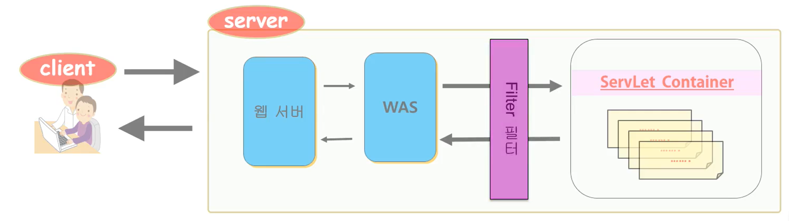

## 1. 서블릿 필터

: 사용자 인증, 로깅 같은 기능을 모든 서블릿이나 JSP에서 공통적으로 필요할 수 있음. 이러한 공통적인 기능들을 서블릿이 호출되기 전에 수행되게 하고 싶거나
서블릿 호출이 끝난 이후에 하고 싶을 때, 이러한 공통적인 기능들을 서블릿 필터로 구현한다.

<p align="center">
    
</p>

WebContent/guestBook.jsp

```jsp
<%@ page language="java" contentType="text/html; charset=UTF-8"
    pageEncoding="UTF-8"%>
<!DOCTYPE html PUBLIC "-//W3C//DTD HTML 4.01 Transitional//EN" "http://www.w3.org/TR/html4/loose.dtd">
<html>
<head>
<meta http-equiv="Content-Type" content="text/html; charset=UTF-8">
<title>방명록 작성</title>
</head>
<body>
<form action="guest" method="post">
	<div>방문자 : <input type="text" name="vistor"><p>
		  내용 : <textarea name="contents" rows="5" cols="20"></textarea><br>
		  <input type="submit" value="작성완료">
	</div>
</form>
</body>
</html>
```

src/package/GuestServlet.java

```java
package com.filter;

import java.io.IOException;

import javax.servlet.RequestDispatcher;
import javax.servlet.ServletException;
import javax.servlet.annotation.WebServlet;
import javax.servlet.http.HttpServlet;
import javax.servlet.http.HttpServletRequest;
import javax.servlet.http.HttpServletResponse;


@WebServlet("/guest")
public class GuestServlet extends HttpServlet {
	private static final long serialVersionUID = 1L;


	protected void doPost(HttpServletRequest request, HttpServletResponse response) throws ServletException, IOException {

		String vistor_=request.getParameter("vistor");
		String contents_=request.getParameter("contents");
		request.setAttribute("vistor", vistor_);
		request.setAttribute("contents", contents_);
		RequestDispatcher dispatcher = request.getRequestDispatcher("guestBookFinal.jsp");
		dispatcher.forward(request, response);
	}

}

```

src/package/CharacterFilter.java

Filter 인터페이스 상속 후 doFilter에 공통적인 작업 작성. chain.doFilter를 호출해야 기존 요청된 서블릿으로 이동한다.

```java
package com.mvc;

import java.io.IOException;

import javax.servlet.Filter;
import javax.servlet.FilterChain;
import javax.servlet.FilterConfig;
import javax.servlet.ServletException;
import javax.servlet.ServletRequest;
import javax.servlet.ServletResponse;
import javax.servlet.annotation.WebFilter;

@WebFilter("/*")
public class CharacterFilter implements Filter {

	@Override
	public void destroy() {
		// TODO Auto-generated method stub

	}

	@Override
	public void doFilter(ServletRequest request, ServletResponse response, FilterChain chain)
			throws IOException, ServletException {

		response.setCharacterEncoding("utf-8");
		response.setContentType("text/html; charset=utf-8");
		request.setCharacterEncoding("utf-8");

		System.out.print("filter 실행전");
		chain.doFilter(request, response);
		System.out.print("filter 실행후");
	}

	@Override
	public void init(FilterConfig arg0) throws ServletException {
		// TODO Auto-generated method stub

	}

}

```

## 2. 필터 등록

xml 방식이나 어노테이션 방식으로 가능

WebContent/WEB-INF/web.xml

```xml
<web-app ...>
    <filter>
        <filter-name>im</filter-name>
        <filter-class>package.CharacterFilter</filter-class>
    <filter>
    <filter-mapping>
        <filter-name>im</filter-name>
        <url-mapping>/*</url-mapping>
    </filter-mapping>

</web-app>
```

혹은

```java
@WebFilter("/*")
public class CharacterFilter implements Filter {
}
```
