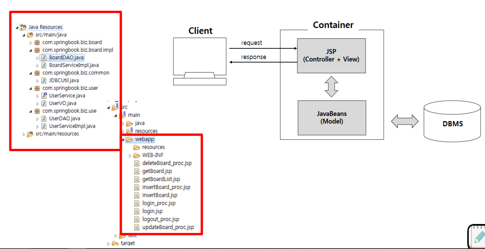
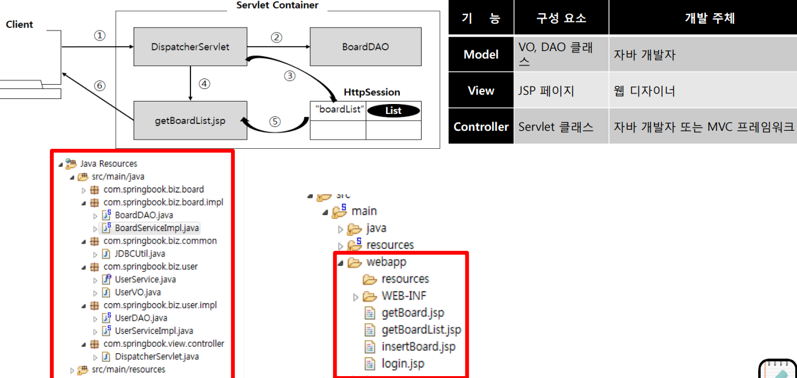
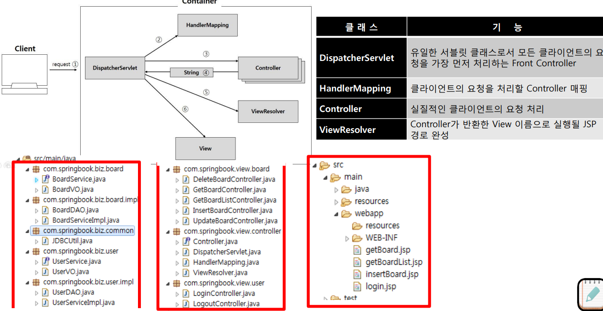

## 1. MVC 패턴 : 모델1 과 모델 2 비교

MVC 패턴 : MVC 패턴의 최대 장점은 사용자에게 보여지는 프레젠테이션 영역과 비즈니스 로직, 데이터 구조가 서로 완전히 분리되어 있다는 점이다.

<p align="center">
    
</p>

## 2. Model 1

적은 개발인력으로 간단한 프로젝트 수행시 사용

<p align="center">
    
</p>
<p align="center">
    
</p>

## 2. Model 2

<p align="center">
    
</p>

- DispatcherServlet : 유일한 서블릿 클래스로서 모든 클라이언트의 요청을 가장 먼저 처리하는 Front Controller

## 3. DispatcherServlet 구현

```java
package com.springbook.view.controller;

import java.io.IOException;
import java.util.List;

import javax.servlet.ServletException;
import javax.servlet.http.HttpServlet;
import javax.servlet.http.HttpServletRequest;
import javax.servlet.http.HttpServletResponse;
import javax.servlet.http.HttpSession;

import com.springbook.biz.board.BoardVO;
import com.springbook.biz.board.impl.BoardDAO;
import com.springbook.biz.user.UserVO;
import com.springbook.biz.user.impl.UserDAO;

public class DispatcherServlet extends HttpServlet {
	private static final long serialVersionUID = 1L;
	public DispatcherServlet() {
		super();
	}

	protected void doGet(HttpServletRequest request, HttpServletResponse response)
			throws ServletException, IOException {
		process(request, response);
	}

	protected void doPost(HttpServletRequest request, HttpServletResponse response)
			throws ServletException, IOException {
		// TODO Auto-generated method stub
		request.setCharacterEncoding("utf-8");
		process(request, response);
	}

	private void process(HttpServletRequest request, HttpServletResponse response) throws IOException {
		// 1. 클라이언트의 요청 path 정보를 추출한다.
		String uri = request.getRequestURI();
		String path = uri.substring(uri.lastIndexOf("/"));
		System.out.println(path);

		// 2. 클라이언트의 요청 path에 따라 적절히 분기처리 한다.
		if (path.equals("/login.do")) {
			System.out.println("로그인 처리");
			// 1. 사용자 입력 정보 추출
			String id = request.getParameter("id");
			String password = request.getParameter("password");

			// 2. DB 연동 처리
			UserVO vo = new UserVO();
			vo.setId(id);
			vo.setPassword(password);

			UserDAO userDAO = new UserDAO();
			UserVO user = userDAO.getUser(vo);

			// 3. 화면 네비게이션
			if (user != null) {
				response.sendRedirect("getBoardList.do");
			} else {
				response.sendRedirect("login.jsp");
			}
		} else if (path.equals("/logout.do")) {
			System.out.println("로그아웃 처리");
			// 1. 브라우저와 연결된 세션 객체를 강제 종료한다.
			HttpSession session = request.getSession();
			session.invalidate();

			// 2. 세션 종료 후, 메인 화면으로 이동한다.
			response.sendRedirect("login.jsp");

		} else if (path.equals("/insertBoard.do")) {
			System.out.println("글 등록 처리");
			// 1. 사용자 입력 정보 추출
			String title = request.getParameter("title");
			String writer = request.getParameter("writer");
			String content = request.getParameter("content");

			// 2. DB 연동 처리
			BoardVO vo = new BoardVO();
			vo.setTitle(title);
			vo.setWriter(writer);
			vo.setContent(content);

			BoardDAO boardDAO = new BoardDAO();
			boardDAO.insertBoard(vo);

			// 3. 화면 네비게이션
			response.sendRedirect("getBoardList.do");

		} else if (path.equals("/updateBoard.do")) {
			System.out.println("글 수정 처리");
			// 1. 사용자 입력 정보 추출
			String title = request.getParameter("title");
			String content = request.getParameter("content");
			String seq = request.getParameter("seq");

			// 2. DB 연동 처리
			BoardVO vo = new BoardVO();
			vo.setTitle(title);
			vo.setContent(content);
			vo.setSeq(Integer.parseInt(seq));

			BoardDAO boardDAO = new BoardDAO();
			boardDAO.updateBoard(vo);

			// 3. 화면 네비게이션
			response.sendRedirect("getBoardList.do");

		} else if (path.equals("/deleteBoard.do")) {
			System.out.println("글 삭제 처리");
			// 1. 사용자 입력 정보 추출
			String seq = request.getParameter("seq");

			// 2. DB 연동 처리
			BoardVO vo = new BoardVO();
			vo.setSeq(Integer.parseInt(seq));

			BoardDAO boardDAO = new BoardDAO();
			boardDAO.deleteBoard(vo);

			// 3. 화면 네비게이션
			response.sendRedirect("getBoardList.do");

		} else if (path.equals("/getBoard.do")) {
			System.out.println("글 상세 조회 처리");
			// 1. 검색할 게시글 번호 추출
			String seq = request.getParameter("seq");

			// 2. DB 연동 처리
			BoardVO vo = new BoardVO();
			vo.setSeq(Integer.parseInt(seq));

			BoardDAO boardDAO = new BoardDAO();
			BoardVO board = boardDAO.getBoard(vo);

			// 3. 검색 결과를 세션에 저장하고 목록 화면으로 이동한다.
			HttpSession session = request.getSession();
			session.setAttribute("board", board);
			response.sendRedirect("getBoard.jsp");

		} else if (path.equals("/getBoardList.do")) {
			System.out.println("글 목록 검색 처리");
			// 1. 사용자 입력 정보 추출(검색 기능은 나중에 구현)
			// 2. DB 연동 처리
			BoardVO vo = new BoardVO();
			BoardDAO boardDAO = new BoardDAO();
			List<BoardVO> boardList = boardDAO.getBoardList(vo);

			// 3. 검색 결과를 세션에 저장하고 목록 화면으로 이동한다.
			HttpSession session = request.getSession();
			session.setAttribute("boardList", boardList);
			response.sendRedirect("getBoardList.jsp");
		}
	}
}

```

src/main/webapp/WEB-INF/web.xml

```xml
<servlet>
    <description></description>
    <display-name>action</display-name>
    <servlet-name>action</servlet-name>
    <servlet-class>com.springbook.view.contreoller.DispatcherServlet</servlet-class>
</servlet>
<servlet-mapping>
    <servlet-name>action</servlet-name>
    <url-pattern>*.do</url-pattern>
</servlet-mapping>
```

## 4. MVC 모델2 개선

dispatherServlet의 크기가 점점 커지기 때문에 또 분리

<p align="center">
    
</p>

- DispatcherServlet : 유일한 서블릿 클래스로서 모든 클라이언트의 요청을 가장 먼저 처리하는 Front Controller
- HandlerMapping : 클라이언트의 요청을 처리할 Controller 매핑
- Controller : 실질적인 클라이언트의 요청 처리
- ViewResolver : Controller가 반환한 View 이름으로 실행될 JSP 경로 완성

**순서 :**

1. DispatcherServlet이 클라이언트의 요청을 받음
2. HandlerMapping을 통해서 요청을 어느 컨트롤러로 보낼지 결정
3. 실질적인 클라이언트의 요청을 컨트롤러가 처리
4. 컨트롤러가 반환한 View 이름으로 실행될 JSP 경로를 ViewResolver가 완성시킴
