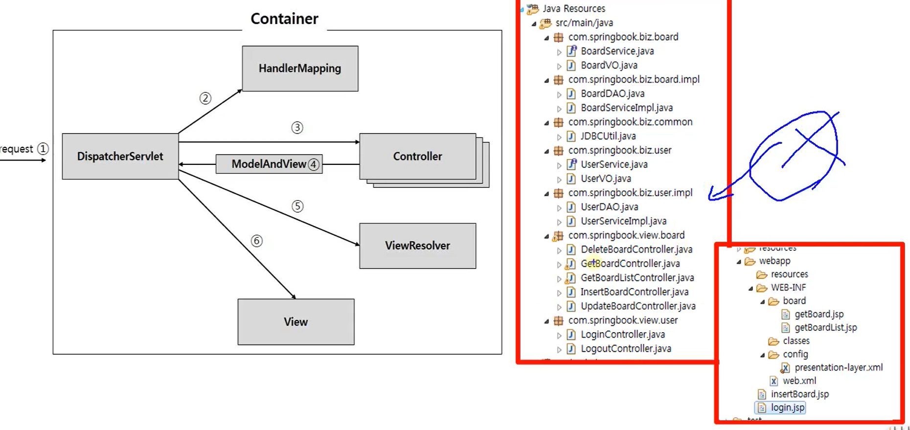
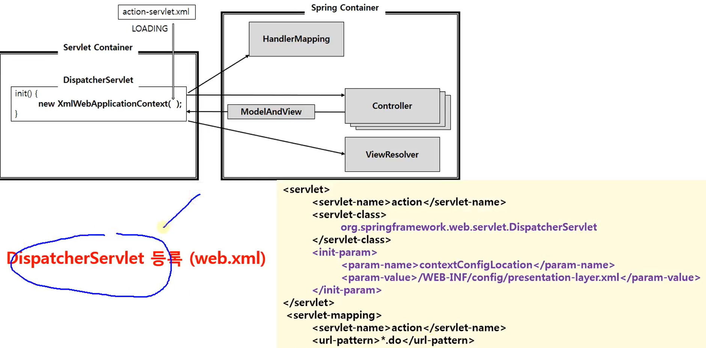
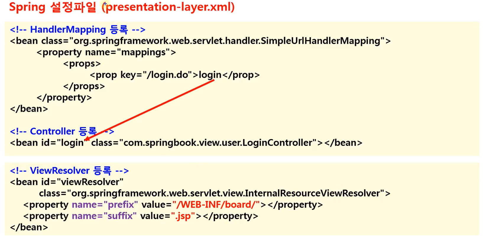

## 1. Spring MVC by XML

컨트롤러만 있음 다른것들은 스프링 컨테이너가 자동으로 해줌

<p align="center">
    
</p>

## 2. DispatcherServlet 등록

<p align="center">
    
</p>

init-param 중요

## 3. 설정파일 등록(이름 중요 x)

<p align="center">
    
</p>

init-param을 생략할 경우 서블릿의 이름 + 하이픈.xml 로 WEB-INF 루트에 위치해야함

DispatcherServlet은 요청이 생기는 순간 생성된다. 만들어지는 순간 HandlerMapping과 컨트롤러, ViewResolver를 생성

- 톰캣이 올라가고
- 요청이 들어올때
- 컨테이너 동작

컨트롤러

```java
package com.springbook.view.user;

import javax.servlet.http.HttpServletRequest;
import javax.servlet.http.HttpServletResponse;

import org.springframework.web.servlet.ModelAndView;
import org.springframework.web.servlet.mvc.Controller;

import com.springbook.biz.user.UserVO;
import com.springbook.biz.user.impl.UserDAO;

public class LoginController implements Controller {

	@Override
	public ModelAndView handleRequest(HttpServletRequest request, HttpServletResponse response) {
		System.out.println("로그인 처리");

		// 1. 사용자 입력 정보 추출
		String id = request.getParameter("id");
		String password = request.getParameter("password");

		// 2. DB 연동 처리
		UserVO vo = new UserVO();
		vo.setId(id);
		vo.setPassword(password);

		UserDAO userDAO = new UserDAO();
		UserVO user = userDAO.getUser(vo);

		// 3. 화면 네비게이션
		ModelAndView mav = new ModelAndView();
		if (user != null) {
			mav.setViewName("redirect:getBoardList.do"); //GetBoardListController에서 .jsp확장자 제거
		} else {
			mav.setViewName("redirect:login.jsp"); // ViewResolver 설정되어있어도 무시하고 리다이렉트
		}
		return mav;
	}

}

```

mav.setViewName()에 redirect가 안붙어 있으면 ViewResolver로 가야하고, 붙어있으면 설정이 무시됨

```java
public class GetBoardListController implements Controller {
    @Override
    public ModelAndView handleRequest(HttpServletRequest request, HttpServletResponse response) {
        BoardVO vo = new BoardVO();
        BoardDAO boardDAO = new BoardDAO();
        List<BoardVO> boardList = boardDAO.getBoardList(vo);
        ModelAndView mav = new ModelAndView();
        mav.addObject("boardList", boardList); //모델 정보 저장
        mav.setViewName("getBoardList.jsp"); //뷰 정보 저장
        return mav;
    }
}

```
