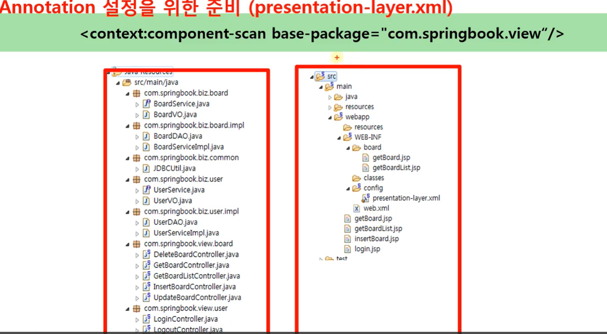
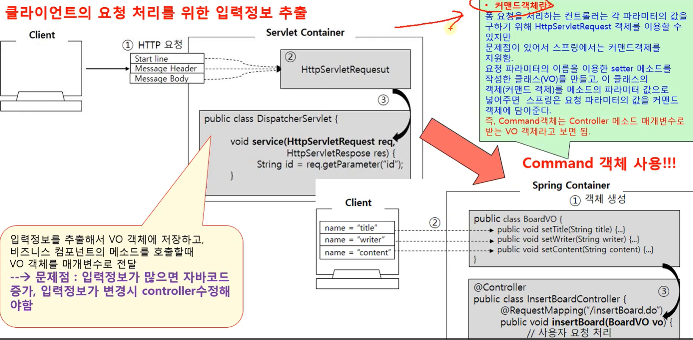
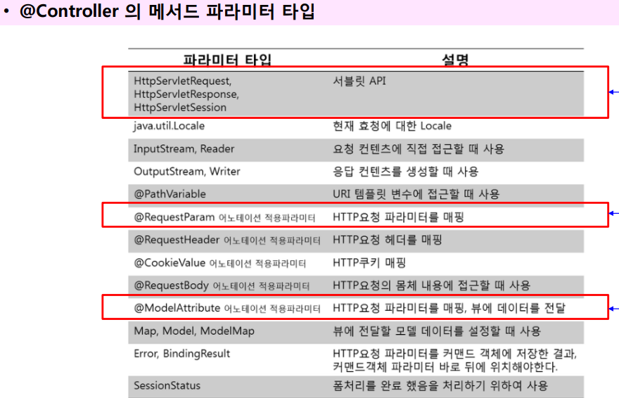
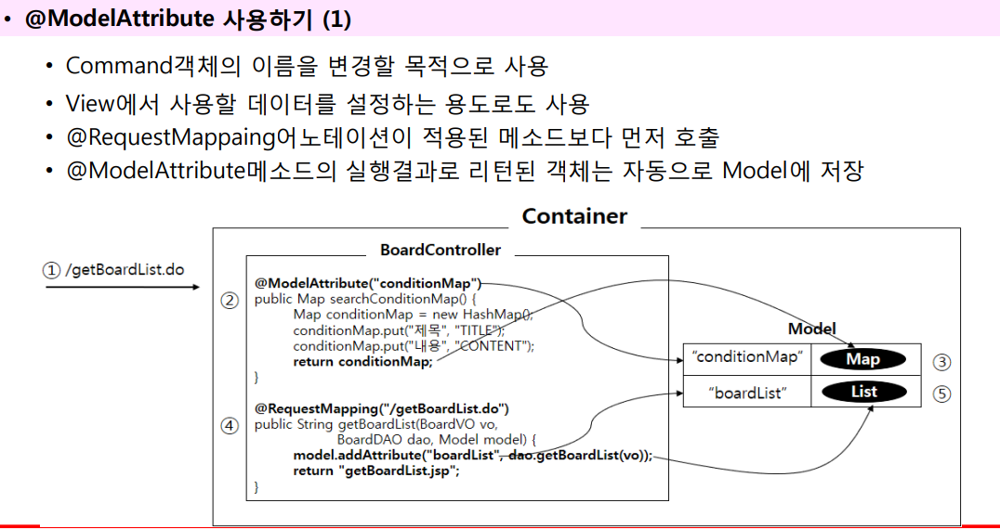
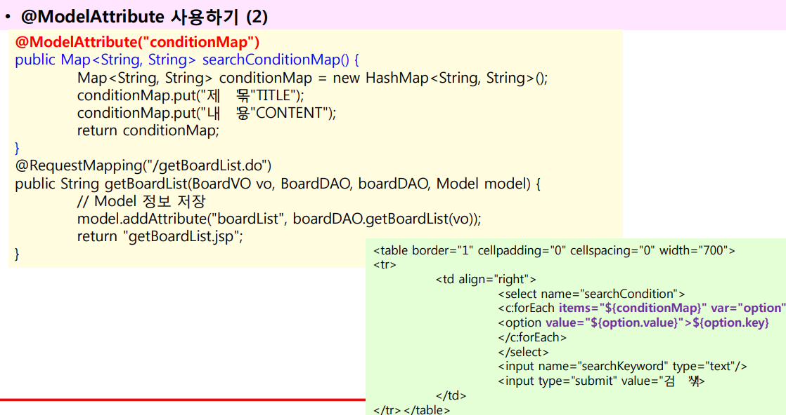
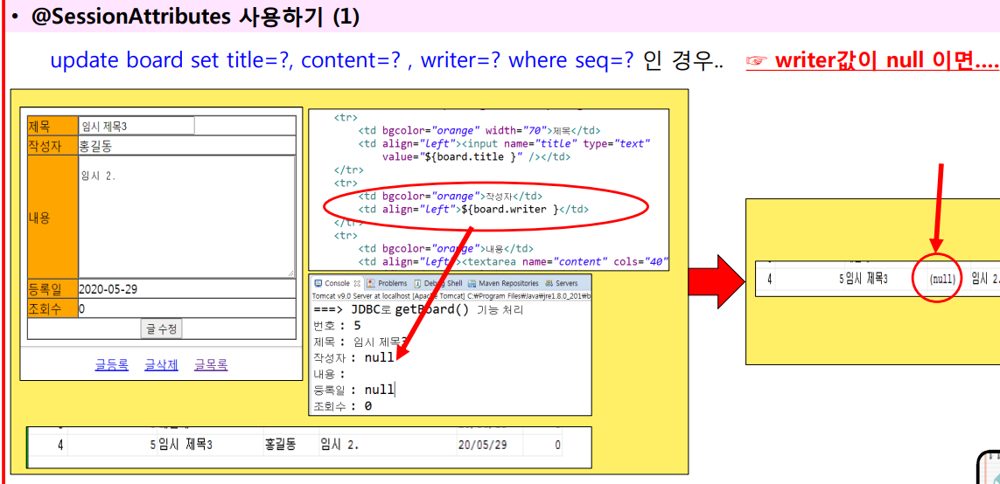
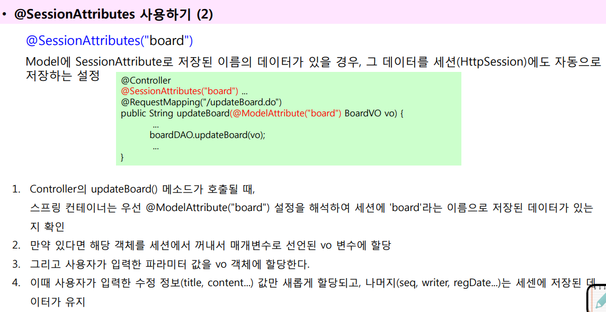
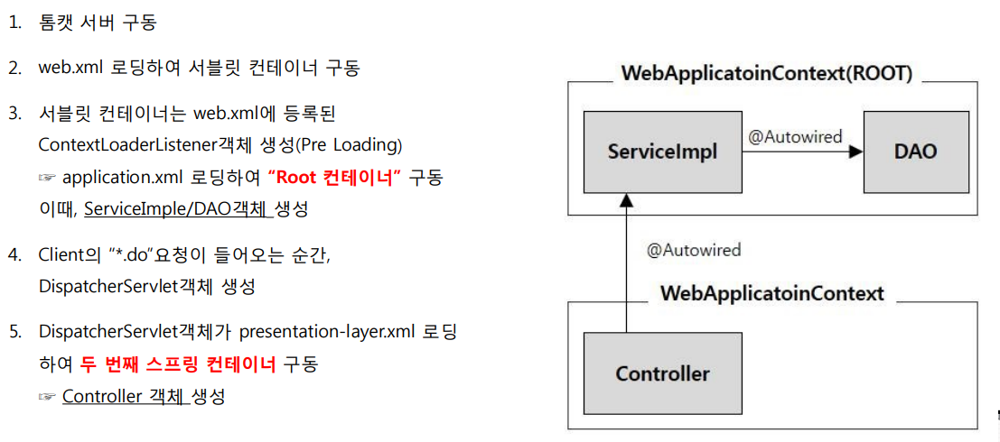
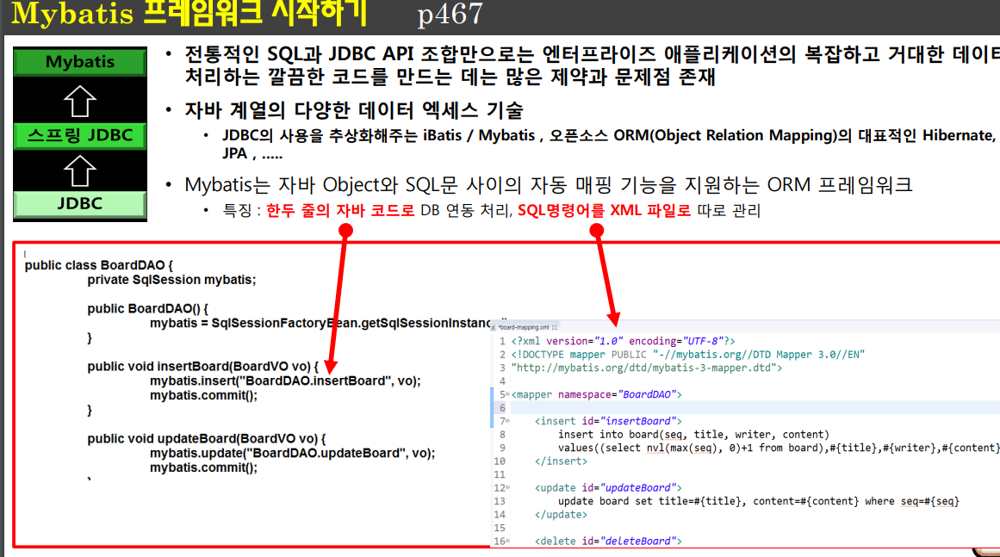

## 1. Spring MVC 어노테이션 설정

**presentation-layer.xml**

<p align="center">
    
</p>

## 2. @Controller

- @Controller가 붙은 클래스를 메모리에 생성하고 Controller 객체로 인식하도록 한다.
- Controller를 POJO(Plain Old Java Object) 스타일로 코딩할 수 있다.
- ViewResolver의 역할도 컨트롤러에 포함된다.

  ```java
  @Controller
  public class InsertBoardController{}
  ```

## 3. @RequestMapping

- 클라이언트의 요청 path에 대해 실행될 메소드를 매핑한다.
- RequestHandler 메서드는 String을 리턴해도 괜찮고, ModelAndView를 리턴해도 됨

```java
@Controller
public class InsertBoardController{
    @RequestMapping(value="/insertBoard.do")
    public void insertBoard(HttpServlet Request req){...}
}
```

## 4. 커맨드 객체

<p align="center">
    
</p>

## 5. 요청 방식에 따른 @RequestMapping 사용

```java
@Controller
public class LoginController{
    @RequestMapping(value="/login.do", method=RequestMethod.GET)
    public String loginView(UserVO vo) {
        vo.setId("test");
        vo.setPassword("test123");
        return "login.jsp";
    }

    @RequestMapping(value="/login.do", method=RequestMethod.POST)
    public String login(UserVO vo, UserDAO userDAO){
        if(userDAO.getUser(vo) != null) return "getBoardList.do";
        else return "login.jsp";
    }
}
```

## 6. @Controller 메서드 파라미터 타입

<p align="center">
    
</p>

## 7. Command 객체 사용

```jsp
<table border="1" cellpadding="0" cellspacing="0">
    <tr>
        <td bgcolor="orange">아이디</td>
        <td><input type="text" name="id" value="${userVO.id }"/></td>
    </tr>
    <tr>
    <td bgcolor="orange">비밀번호</td>
        <td><input type="password" name="password" value="${userVO.password}"/></td>
    </tr>
    <tr>
        <td colspan="2"><input type="submit" value="로그인"/></td>
    </tr>
</table>

```

커맨드 객체의 이름을 바꾸고 싶다면

```java
@RequestMapping(value = "/login.do", method = RequestMethod.GET)
public String loginView(@ModelAttribute("user") UserVO vo) {
    System.out.println("로그인 화면으로 이동...");
}
```

```jsp
<table border="1" cellpadding="0" cellspacing="0">
    <tr>
        <td bgcolor="orange">아이디</td>
        <td><input type="text" name="id" value="${user.id }"/></td>
    </tr>
    </tr>
</table>
```

```
커맨드 객체의 이름은 특별히 변경하지않으면….
클래스 이름의 첫 글자를 소문자로 한 이름으로
자동 설정!
```

## 8. Servlet API 사용

Servlet 에서 제공하는 HttpServletRequest, HttpServletResponse, HttpSession, Locale 등 다양한 객체를 매개 변수로
받을 수 있다

```java
    @RequestMapping(value="/login.do", method=RequestMethod.POST)
    public String login(UserVO vo, UserDAO userDAO, HttpSession session) {
        UserVO user = userDAO.getUser(vo);
        if(user != null) {
        session.setAttribute("userName", user.getName());
        return "getBoardList.do";
        }
        else return "login.jsp";
    }
```

• Command객체에는 없는 파라미터를 Controller클래스에서 사용하려면? => RequestParam

```java

@Controller
public class BoardController {
    @RequestMapping("/getBoardList.do")
    public String getBoardList(@RequestParam(value="searchCondition", defaultValue="TITLE" required=false) String condition, @RequestParam(value="searchKeyword", defaultValue="", required=false) String keyword){

    }

}
```

```
value : 화면으로부터 전달될 파라미터 이름
defaultValue : 화면으로부터 전달될 파라미터 정보가 없을 때의 설정할 기본값
required : 파라미터의 생략 여부
```

## 9. Model Attribute 사용

<p align="center">
    
</p>
<p align="center">
    
</p>

## 10. SessionAttributes 사용

<p align="center">
    
</p>

<p align="center">
    
</p>

## 11. Layer 통합

<p align="center">
    
    
    
</p>

## 12. 스프링 컨테이너 관계

<p align="center">
    
</p>

## 13. mybatis

<p align="center">
    
</p>
