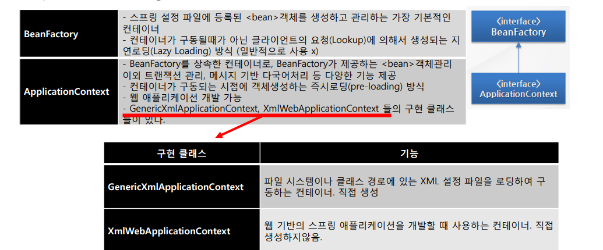
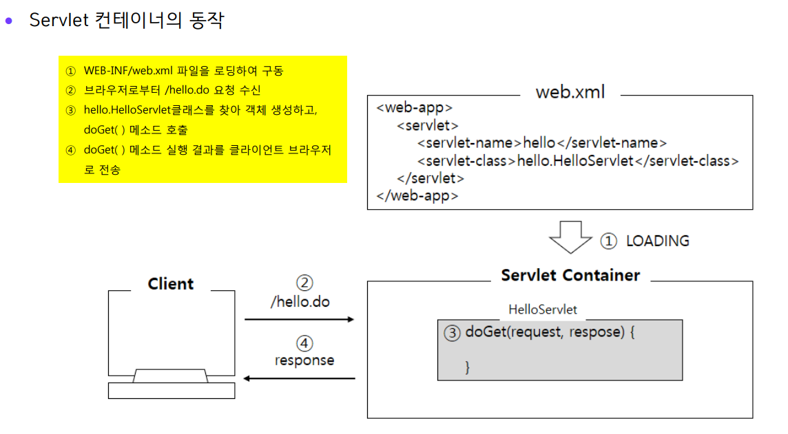
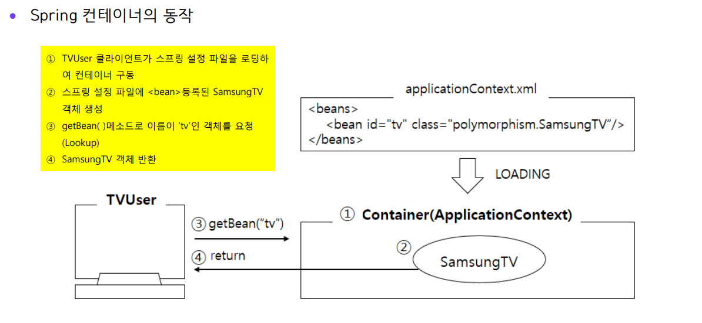

## 1. 스프링 프로젝트 Setting

**이클립스 Spring Tools 3 기준**

```
maven 업데이트 필요
```

- 1. Project Explorer - New - Other
- 2. Spring - Spring Legacy Project
- 3. Tmeplate - Spring MVC Project 설정

```
spring mvc project (regacy) 폴더 구조


- Java Resources
    - src/main/java
    - src/main/resources
        - META-INF
        - log4j.xml
    - src/test/java
    - src/test/resources
- src
    - main
        - java
        - resources
        - webapp
            - resources
            - WEB-INF
                - classes
                - spring
                - views
                - web.xml
    - test
- target
- pom.xml // maven(빌드도구) 프로젝트 오브젝트 모델, 메이븐 프로젝트와 관련된 다양한 정보를 처리하기 위한 용도

```

```
1. pom.xml의 project-properties-org.springframework-version 5점대 버전으로 수정!
2. 프로젝트 우클릭 - Properties - Project Facets - JAVA version 수정
3. Runtime에 Tomcat 체크해서 연결
4. window - preferences - general - workspace - text file encoding => UTF8
5. Web - encoding UTF8 설정
```

## 2. 설정파일 실습

Java Resources -> /src/main/resources 우클릭 -> New -> Other -> Spring - Spring Bean Configuration file

파일이름은 아무거나 해도 상관없음!

src/main/resources/applicationContext.xml

```xml
<?xml version="1.0" encoding="UTF-8"?>
<beans ... >
    <bean id="TV" class="com.myspring.step1.SamsungTV"></bean>
</beans>
```

서블릿 컨테이너에서 일을 하는 단위는 서블릿이며 스프링 컨테이너 내부의 일을하는 단위는 Bean이다.
아이디는 따로 작성할 필요가 없다.

```
JAVA 섬의 커피콩..?
```

스프링 프레임워크를 이용하기 위해서는 스프링 컨테이너를 구동시켜야한다. 컨테이너를 구동할때, 이 설정 파일을 읽는다.

```java

import org.springframework.context.support.AbstractApplicationContext;
import org.springFramework.context.support.GenericXmlApplicationContext;

class TVUser {
    public static void main(String[] main) {
         AbstractApplicationContext factory = new GenericXmlApplicationContext("applicationContext.xml");

        TV tv = (TV)factory.getBean("tv"); // return Object -> Lookup 방식
        tv.powerOn();

        factory.close();
    }
}
```

## 3. 스프링 컨테이너

: 스프링 프레임워크를 초기화 하는 역할

- 처리 순서

  - 1. 스프링 컨테이너 생성
  - 2. Bean들이 들어있는 XML 파일 읽음
  - 3. XML 파일에 등록된 Bean들의 Life Cycle과 Dependency가 관리되기 시작

- 스프링 DI컨테이너 종류

<p align="center">
    
</p>

## 4. Servlet 컨테이너와 스프링 컨테이너 동작 비교

<p align="center">
    
</p>

---

<p align="center">
    
</p>

## 5. 스프링 컨테이너 설정 파일 이론

- \<beans> 루트 엘리먼트

  - 스프링 설정파일 이름은 상관없다. 단 \<beans> 루트 엘리먼트 사용
  - \<bean>의 생명주기를 관리하고 여러 가지 서비스를 제공하는 가장 중요한 역할 담당
  - \<beans> 엘리먼트 시작태그에 네임스페이스를 비롯한 XML 스키마 관련 정보 서렂ㅇ
  - spring-beans.xsd 스키마 문서가 schemaLocation 등록 : \<import>, \<bean>, \<description>>, \<alias>의 자식 엘리먼트로 사용 가능

- \<import> 엘리먼트

  - 개발자가 만든 모든 클래스를 \<bean>으로 등록/관리 하지만 단순히 \<bean> 등록 외에도 트랜잭션 관리, 예외처리, 다국어 처리 등의 복잡하고 다양한 설정필요로 설정파일이 길어짐

    - 기능별로 여러 XML 파일로 분리 설정

    ```xml
    ex) applicationContext.xml

    <beans>
        <import resource ="context-datasource.xml"/>
        <import resource ="context-transaction.xml"/>
    </beans>
    ```

- \<bean> 엘리먼트

  - 클래스 등록시 사용하는 엘리먼트로서 id속성(생략가능), class속성(필수) 사용

    ````xml
    ex) applicationContext.xml

    <beans xmlns ...>
        <bean class = "com.myspring.SamsungTV"></bean>
    </beans>

    <!--

    id속성명은 자바식별자작성규칙에 따름 (특수기호가 포함된 id는 name속성으로 대신)

    ex)
    id=“7userService” (x 숫자로 시작)
    id=“user service” (x 공백 포함)
    id=“user#Service:lmpl” (x 특수기호 사용)
    name=“http://www.daum.net”
    -->

    ```
    ````

- \<bean> 엘리먼트 속성(1)

  - init-method 속성 : Servlet의 init()과 같은 역할, 객체 생성시 초기화 작업

    ```xml
    ex)
        <bean id="tv" class="com.myspring.SamsungTV" init-method="initMethod"/>
    ```

    ```java
        pulic class SamsungTV implements TV{
            public void initMethod( ){
                System.out.println(“객체 초기화 작업 처리…””); }
    ```

- \<bean> 엘리먼트 속성(2)

  - destroy-method 속성 : 객체 삭제 시 실행 작업
    ```xml
    ex)
        <bean id="tv" class="com.myspring.SamsungTV" destroy-method="destroyMethod"/>
    ```

- \<bean> 엘리먼트 속성(3)

  - lazy-init 속성 : 즉시로딩(pre-loading)방식이지만, 요청할 때 생성하도록 설정
    ```xml
    ex)
        <bean id="tv" class="com.myspring.SamsungTV" lazy-init="true"/>
    ```

- \<bean> 엘리먼트 속성(4)
  - scope 속성 : scope 속성의 기본값은 싱글톤, bean 객체가 단 하나만 생성
    ```xml
    ex)
        <bean id="tv" class="com.mysring.SamsungTV" scope="singleton"/>
    ```
    ```xml
    ex) 요청마다 생성
        <bean id="tv" class="com.myspring.SamsungTV" scope="prototype"/>
    ```
