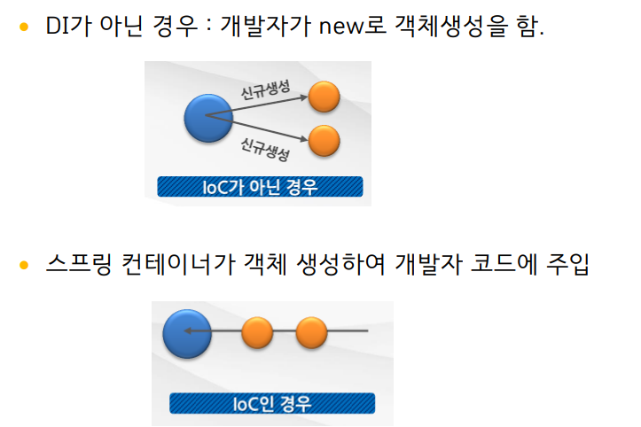
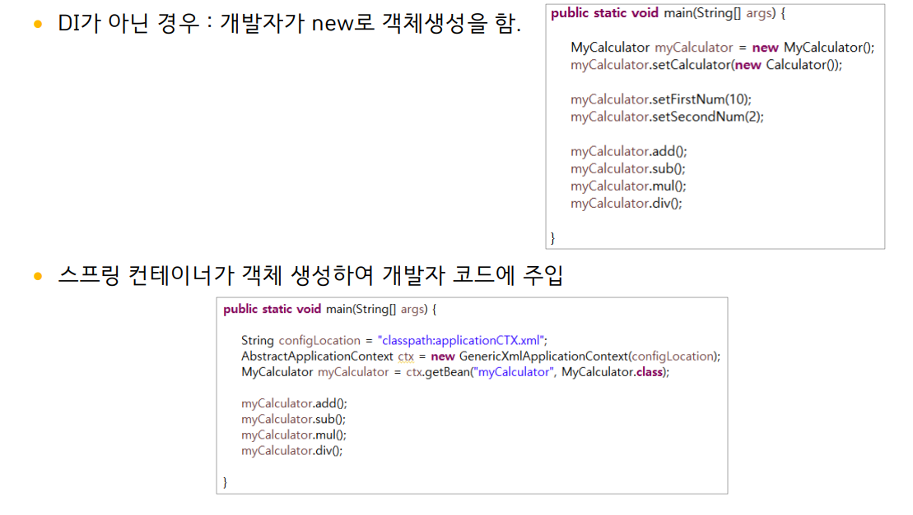
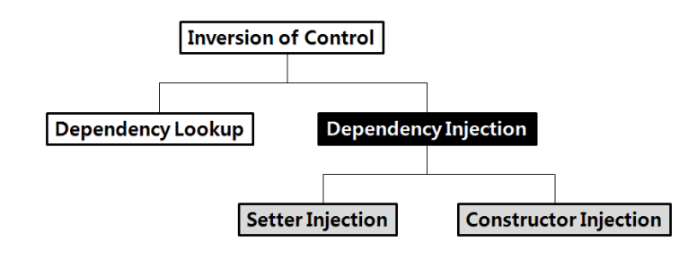

## 1. IoC(Inversion of Control) : 제어의 역전

IoC란 제어의 역전이라는 뜻으로 프로그램의 흐름을 개발자가 아닌 프레임워크가 주도하게 된다는 디자인 패턴이다.

- 객체의 생성에서 소멸까지 프레임워크가 관리한다.
- DI(Dependency Injection) 가능
- AOP(Aspect Oriented Programming) 가능

## 2. IoC인 경우와 아닌 경우 비교

<p align ="center">
    
</p>

<p align ="center">
    
</p>

## 3. DL 방식과 DI 방식

<p align ="center">
    
</p>

**DL(Dependency Lookup)**:

- 저장소에 저장되어 있는 bean에 접근하기 위해 컨테이너가 제공하는 API를 이용해서 bean을 lookup 하는 방식

  ```java
  ApplicationContext factory = new ClassPathXmlApllicationContxt("");
  factory.getBean();
  ```

  - container 밖에서 실행 할 수 없음
  - 테스트하기 매우 어려우며, 코드양이 증가
  - String 타입이 아니므로 Object 타입을 받아서 매번 Casting해야함
  - 실제 애플리케이션 개발과정에서 사용X

**DI(Dependency Injection)** :

- 컨테이너가 직접 의존 관계를 bean 설정 정보를 바탕으로 자동으로 연결해 주는 것

  ```xml
  <bean id ="a" class=""/>
  <bean id="b" class="">
      <construct-arg>
          <ref bean="a"/>
      </construct-arg>
  </bean>
  ```

- 컨테이너가 흐름의 주체가 되어 application 코드에 의존관계를 주입하면 실행시에 동적으로 의존 관계가 생성
- 클래스의 상속이 필요 없음
- 개발자들은 bean 설정파일에서 의존관계가 필요하다는 것을 추가하면 된다.

## 4. 구현 방법

**setter injection** :

- JavaBeans의 property 구조를 이용한 방식, SpringFramework가 주로 이용하는 방법
- 오브젝트가 Container에 의해서 만들어지고 나서 모든 Dependency들이 Setter 메소드를 통해서 주입
- 장점
  - JavaBeans property 구조를 사용하기 때문에 IDE 등에서 개발하기 편리
  - 상속시 구조가 그대로 전달됨
  - Getter 메소드를 통해서 현재 오브젝트의 상태 정보를 얻어올 수 있음
- 단점
  - Setting 순서를 지정 할 수 없음
  - 모든 필요한 property가 세팅되는 것에 대해서 보장할 수 없음

**constructor injection** :

- 클래스의 생성자를 이용하는 방법
- 필요한 의존성을 포함하는 클래스의 생성자를 만들고 이를 통해 의존성을 주입
- 생성자의 매개변수를 이용해서 여러개의 인자를 주입할 수 있다.
