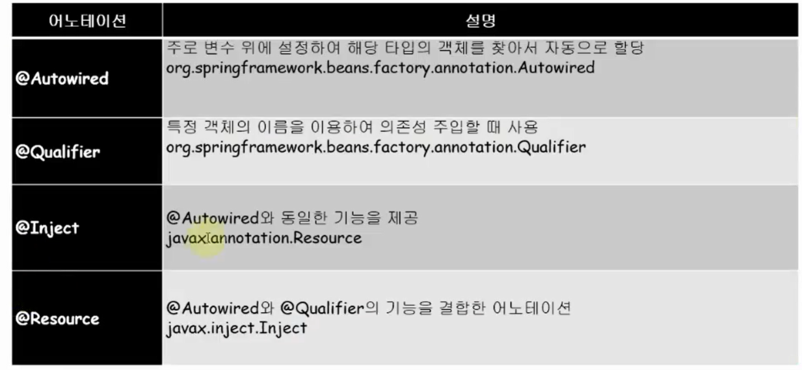

## 1. 어노테이션 방식

DI 어노테이션 기반 설정을 위해서 Context 네임스페이스를 추가해야 한다.
[Namespaces] 탭에서 'context' 항목 체크

com.springbook.biz 패키지로 시작하는 모든 클래스를 스캔

```
ex)
    com.springbook.biz
    com.springbook.example1
```

```xml
<beans>
    <context:component-scan base-package="com.springbook.biz"/>
</beans>

```

스캔해야할 패키지를 지정해서 스캔할 수 있도록 함

```java
@Component("tv") //괄호는 필수가 아님
public class LgTV implements TV{
    public LgTV(){
        System.out.println("객체 생성");
    }
}

```

컴포넌트의 이름을 붙히지 않았을때, **소문자**로!

```java
TV tv1 = (TV) factory.getBean("samsungTV");
```

<p align="center">
    
</p>

## 2. Autowired

주로 변수 위에 설정하여 해당 타입의 객체를 찾아서 자동으로 할당한다.
같은 타입의 빈이 여러개 존재하면 혼란이 생길 수 있다.

```java
@Component("tv")
public class LgTV implements TV {
    @Autowired // 생성자나 메서드, 필드 뒤에 모두 사용 가능하다. 타입을 보고 자동으로 삽입
    private Speaker speaker;
}
```

## 3. Qualifier

특정 객체의 이름을 이용해서 의존성 주입

```java
@Component("tv")
public class LgTV implements TV {
    @Autowired
    @Qualifier("apple")
    private Speaker speaker;
}
```

## 3. Resource

@Autowired 와 @Qualifier의 기능을 결합한 어노테이션

```java
@Component("tv")
public class LgTV implements TV {
    @Resource(name="apple")
    private Speaker speaker;
}
```

## 4. Inject

@Autowired와 동일한 기능을 제공

xml 방식은 xml의 파일의 작성에 번거로운 것이 단점이며, 어노테이션 방식은 작성하기는 쉬우나
수정될 때마다 재컴파일을 해줘야한다. 두 방식을 혼용해서 작업해도 된다.
