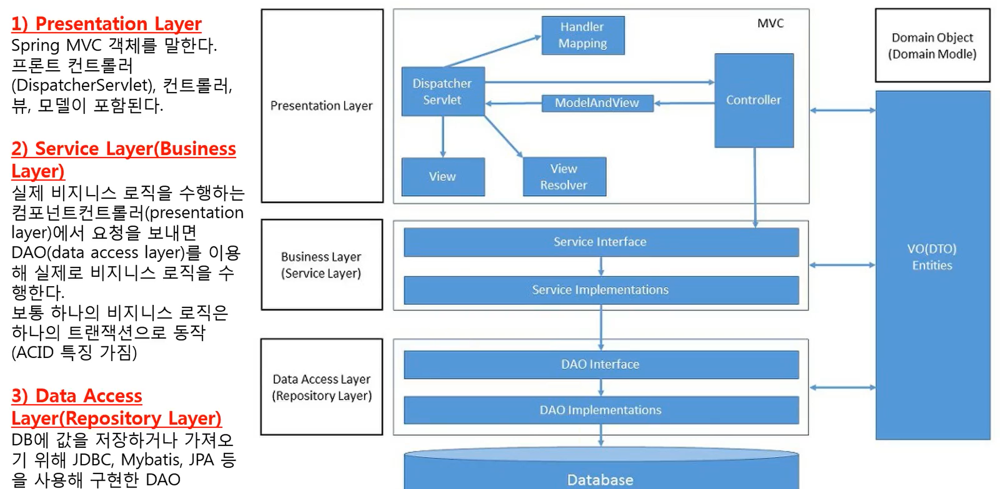

## 1. Layerd Architecture

시스템을 구축할 때 계층을 나눈다.

    

    

- **Presentation Layer** : 클라이언트의 요청을 받고 클라이언트에게 응답을 해주는 계층
- **Business Layer** : 사용자의 요청에 대한 비즈니스 로직 담당

## 2. Spring Layerd Archtecture

레이어간 데이터 전달은 VO(Value Object, DTO)를 통해서 전송함

    

1. 클라이언트에서 요청이 들어오면 먼저 presentation Layer에서 DispatcherServlet이 HandelerMapping을 통해서 Controller에게 Client 요청이 무엇인지 알린다.

2. Controller는 Client 요청 처리를 Business Layer 에게 요구한다.

3. Business Layer에 넘겨줄 데이터(Client가 요청한 데이터)가 있으면 Domain Object에 담는다.

4. Business Layer는 Presentaion Layer와 Interface를 통해서 통신하며, Client 요청을 적절히 처리한 후 데이터베이스에 데이터를 저장하거나 데이터를 꺼내기 위해 Data Access Layer에 요청한다.

5. 이 때, 비즈니스 로직을 수행하기 위해 데이터가 필요하면 Domain Object 에서 가져오고, Data Access Layer에 넘겨줄 데이터가 있으면 Domain Object에 담는다.

6. Data Access Layer 역시 Business Layer 와 Interface를 통해서 통신하며, Business Layer의 요청을 처리한다.

7. 이 때, 데이터베이스에 저장하기 위해 필요한 데이터를 Domain Object에서 가져오고, 데이터베이스에서 데이터를 가져와 반환할 데이터가 있다면 Domain Object에 저장한다.

8. 모든 처리가 끝나면 Controller 는 Client 요청이 처리된 데이터와 사용할 View 정보를 Domain Object에서 가져와서 ModelAndView에 담는다. 그리고 ModelAndView 객체를 DispatherServlet에 넘긴다.

9. ModelAndView 객체가 DispatcherServlet에 전달되면, DispatcherServlet은 ViewResolver를 통해서 View를 선택하고 Client에게 요청이 처리된 데이터를 화면에 출력한다.

    

## 3. Layer 별 Annotaion

@Component를 상속해서 수행 역할별 분류 :

- @Service : xxxServiceImpl
  - 비즈니스 로직을 처리하는 Service 클래스
- @Repository: xxxDAO
  - 데이터베이스 연동을 처리하는 DAO 클래스
- @Controller: xxxController
  - 사용자 요청을 제어하는 Controller 클래스
